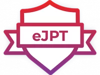

  🙏🏿 <i>Don't let anyone ruin your day, ruin it youself.</i> 🙏🏿

___

- 🔭 I'm learning programming and scripting to better ground myself in Cybersecurity and DevOps
- 💻 I currently use [TryHackMe](https://tryhackme.com/p/TurboYetiii) and [PentesterLab](https://pentesterlab.com/profile/YetiLike) for practical learning of Cybersec concepts; as well as any other resources I am able to access
- I use Github to keep me accountable and adapt what I've learned into real-world processes and practices.
- I hope to be able to reach a point where I can actively contribute to the wonderful world of open-source ✨.

___

<h2 align="center"> 🌱 I’m currently learning </h2>

  - ### Languages
      
  
  - ### 🖥 Platforms
   

 
 

___

<h2 align="center"> 🤔 I’m looking for help with </h2>
  
  - **Being a better scripter/programmer**: Any resources or tips that have helped you on your journey would be greatly appreciated!
  - **Help with Unix and Bash**: Still getting used to the environment and syntax for Unix. I'm working towards the Linux Essentials Certification but any other tips would be a massive help.
  - **Collaboration**: Collaboration can sometimes substitute for not having a mentor in these spaces. I'm happy to work on projects to help me improve coding and security practices.
  - **Good books!**: I like to read in my downtime so appreciate any book recommendations you may have. 😁

___

<h2 align="center">🏆 My Certifications </h2>

  
  
  
  
  
  
  

 
 
  
<!--
**Os51/os51** is a ✨ _special_ ✨ repository because its `README.md` (this file) appears on your GitHub profile.

Here are some ideas to get you started:

- 🔭 I’m currently working on ...
- 🤔 I’m looking for help with
- 👯 I’m looking to collaborate on ...
- 🤔 I’m looking for help with ...
- 💬 Ask me about ...
- 📫 How to reach me: ...
- 😄 Pronouns: ...
- ⚡ Fun fact: ...
-->
